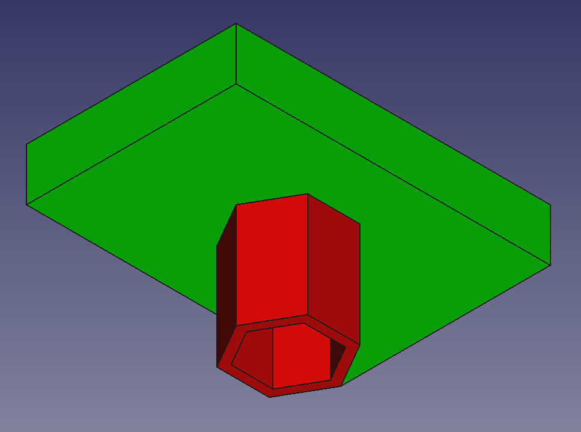

# FREECAD BUILD

command line tools for working with FreeCAD files, including visual mesh diffs and headless part export.



`freecad-export` is a standalone tool for converting FCStd files into a variety of formats including STEP, 3MF, and IGES

`freecad-diff` can display a visual diff between any two files supported by FreeCAD

`freecad-difftool` can be used to integrate visual diffs into standard git workflows

## limitations

- these tools have only been tested with Debian Trixie and FreeCAD version 0.21.2
- **sub**-assemblies of an assembly are not currently included diffs or exports (this is on the roadmap)
- if a part is modified but its parent assembly is not subsequently saved, the assembly diff will be skipped by git

## installation

install dependencies:

```shell
sudo apt install git rsync make freecad
```

clone and enter this repository:

```
git clone https://github.com/khimaros/freecad-build
cd freecad-build
```

install freecad-build tools:

```shell
sudo make install
```

uninstallation is also straightforward:

```shell
sudo make uninstall
```

## integration

check out [freecad-build-template](https://github.com/khimaros/freecad-build-template) for an
example of how to integrate this into your own project.

## usage

convert an FCStd file to a STEP file:

```shell
freecad-export path/to/my.FCStd path/to/my.step
```

show the differences between two STEP files:

```shell
freecad-diff path/to/left.step path/to/right.step
```

## troubleshooting

check the log output on the console, make sure there are no `recompute` errors.

inspect the **Modified** and **Previous** features to make sure they look as expected.

run the build in interactive mode, `export INTERACTIVE=1` before invoking
